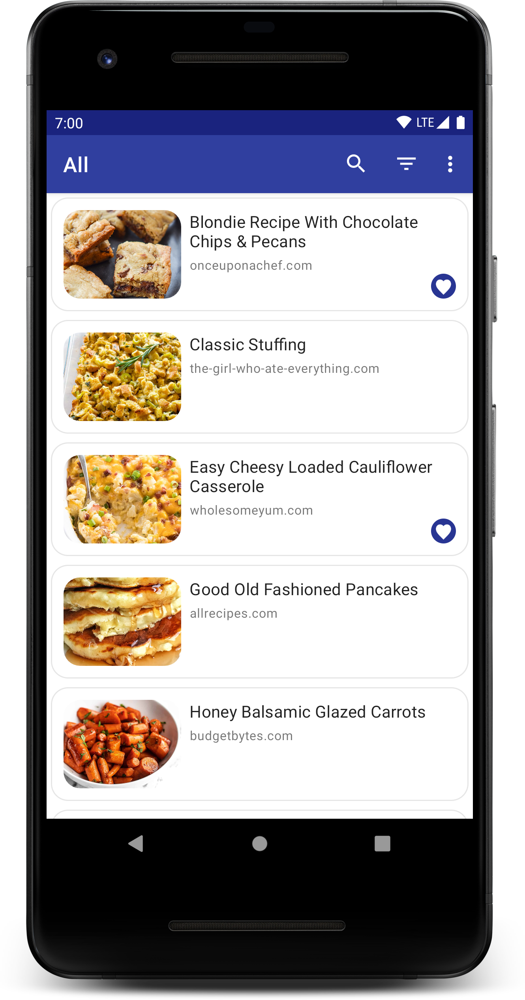

# Recipier

Recipier stores your online recipes in a clean interface that allows you to quickly search and filter. The app uses a Flask RESTful API backend server, written in Python, to retrieve important recipe information from the webpage.

## Technologies Used
* Kotlin
* [Kotlin Coroutines](https://github.com/Kotlin/kotlinx.coroutines)
* [Retrofit](https://square.github.io/retrofit/)
* [Moshi](https://github.com/square/moshi)
* [Jetpack Navigation](https://developer.android.com/guide/navigation)
* [Room](https://developer.android.com/topic/libraries/architecture/room) + SQLite 
* [Dagger 2](https://github.com/google/dagger) + Hilt

## Screenshots

  
  
Fragment showing the user's list of saved recipes

  
  
Fragment showing the details of a saved recipe

